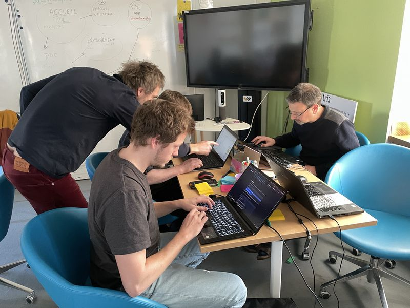

# Développer

Cette section regroupe les informations utiles pour intégrer ou faire évoluer la Console.

## Organisation générale

La Console est une application Spring Boot.

Les principales couches sont :

- `src/main/java/org/georchestra/console/ws` : contrôleurs web et API ;
- `src/main/java/org/georchestra/console/dao` : accès aux données PostgreSQL ;
- `src/main/java/org/georchestra/console/mailservice` : construction et envoi des mails ;
- `src/main/resources/templates` : vues Thymeleaf ;
- `src/main/resources/static` : CSS et JavaScript ;
- `src/main/resources/mail-templates` : modèles de mails embarqués ;
- `docs` : documentation MkDocs.

## Séparation interface et API

L'interface manager utilise des pages Thymeleaf et certains appels JSON internes au navigateur.

Les API exposées sont réparties en trois familles :

- `/private/*` : endpoints d'administration utilisés par l'interface et les intégrations authentifiées ;
- `/public/*` : endpoints publics de configuration de formulaires ;
- `/internal/*` : API internes geOrchestra, utilisées par d'autres composants.

## Conventions

- Utiliser `./mvnw` pour les commandes Maven.
- Conserver le contexte applicatif `/console`.
- Utiliser les objets et DAO du module `georchestra-ldap-account-management` pour manipuler LDAP.
- Ajouter des tests ciblés quand une règle de droit ou un endpoint est modifié.
- Mettre à jour la documentation si un écran, une propriété ou une API change.
