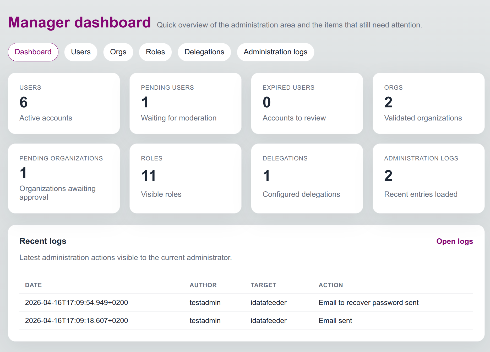
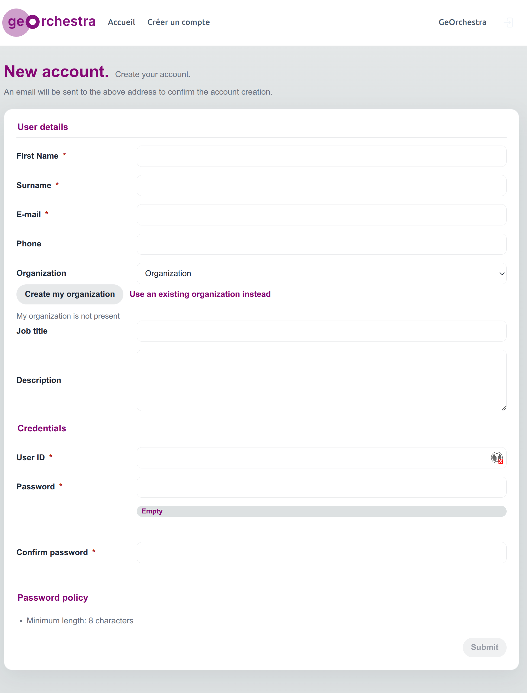

# Prendre en main rapidement

Cette page présente les premiers repères pour administrer les droits depuis l'interface graphique.

## Accéder au manager

L'espace d'administration est accessible depuis `/console/manager`.

Selon l'installation, l'URL peut être :

- `http://localhost:8081/console/manager` en accès direct local ;
- `http://localhost:8080/console/manager` via le gateway geOrchestra en environnement de développement.

L'accès dépend des rôles de l'utilisateur connecté. Les rôles courants sont :

- `SUPERUSER` pour l'administration globale ;
- `ORGADMIN` pour l'administration d'un périmètre délégué.

## Comprendre le tableau de bord

Le tableau de bord donne une vue rapide des objets à administrer : utilisateurs, demandes en attente, organisations, rôles, délégations et logs récents.

Utilisez les cartes pour accéder rapidement aux listes correspondantes. Les compteurs permettent d'identifier les éléments à traiter, par exemple les utilisateurs ou organisations en attente de validation.

## Parcours minimal

Pour gérer un utilisateur :

1. Ouvrir l'onglet `Users`.
2. Rechercher l'utilisateur par nom, identifiant, e-mail ou organisation.
3. Ouvrir sa fiche.
4. Vérifier son organisation, son statut et ses rôles.
5. Modifier les informations nécessaires puis enregistrer.

Pour créer un compte depuis l'interface publique :

1. Ouvrir `/console/account/new`.
2. Renseigner l'identité, l'e-mail, l'organisation et les informations demandées.
3. Créer l'organisation si elle n'existe pas encore.
4. Valider la demande.
5. Attendre la validation si la modération des inscriptions est activée.

## Ce qu'il faut retenir

- Les droits applicatifs sont portés par les rôles.
- Le rattachement à une organisation détermine souvent le périmètre fonctionnel.
- Un administrateur délégué ne voit que les objets compris dans sa délégation.
- Les actions sensibles sont tracées dans les logs d'administration.
