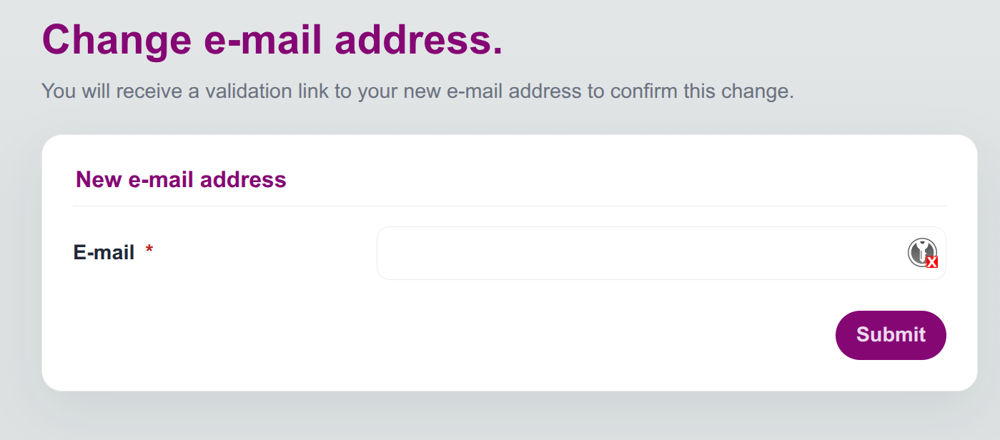
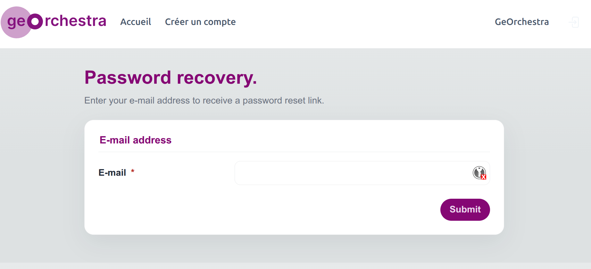

# Barre ou menu d'outils

Le menu du manager regroupe les écrans utilisés pour administrer les droits.

## Dashboard

Le tableau de bord donne une synthèse des comptes, organisations, rôles et logs récents.

Il est utile pour :

- repérer les comptes en attente ;
- repérer les comptes expirés ;
- accéder rapidement aux organisations en attente ;
- consulter les dernières actions d'administration.

## Users

L'onglet `Users` permet de parcourir les comptes visibles par l'administrateur courant.

Les filtres de gauche donnent accès aux vues principales :

- tous les utilisateurs visibles ;
- les utilisateurs en attente ;
- les utilisateurs expirés ;
- les utilisateurs par rôle visible.

Depuis la liste, il est possible d'ouvrir une fiche utilisateur.

Une fiche utilisateur regroupe plusieurs onglets :

- `Infos` pour l'identité, l'e-mail, l'organisation, l'expiration et les métadonnées du compte ;
- `Roles` pour ajouter ou retirer des rôles ;
- `Messages` pour consulter les messages envoyés à l'utilisateur et envoyer un message lorsque l'envoi de mails est activé dans la configuration ;
- `Logs` pour consulter les actions d'administration liées à ce compte ;
- `Manage` pour supprimer le compte si l'action est autorisée.

## Orgs

L'onglet `Orgs` sert à gérer les organisations.

Un super-administrateur peut créer une organisation, modifier ses informations et supprimer une organisation. Un administrateur délégué ne voit que les organisations comprises dans son périmètre.

Les informations principales sont :

- nom ;
- nom court ;
- type d'organisation ;
- e-mail et site web ;
- identifiant d'organisation ;
- adresse ;
- zone de compétence si cette fonctionnalité est activée.

## Roles

L'onglet `Roles` sert à gérer les rôles applicatifs.

Un rôle représente un droit ou un groupe de droits consommé par les autres applications geOrchestra. Les rôles système comme `SUPERUSER`, `ORGADMIN`, `USER`, `PENDING` ou `EXPIRED` ont une signification fonctionnelle particulière.

Depuis une fiche rôle, il est possible de :

- modifier son identifiant ou sa description si le rôle n'est pas protégé ;
- consulter les utilisateurs membres ;
- ajouter ou retirer des utilisateurs ;
- supprimer le rôle si l'action est autorisée.

## Delegations

L'onglet `Delegations` est réservé aux super-administrateurs.

Une délégation associe un utilisateur administrateur à :

- une liste d'organisations qu'il peut administrer ;
- une liste de rôles qu'il peut attribuer ou retirer.

Cette délégation limite ce qu'un administrateur d'organisation peut voir et modifier dans le manager.

## Logs

L'onglet `Logs` affiche les actions d'administration.

Les filtres disponibles permettent de retrouver une action par :

- auteur ;
- cible ;
- type d'action ;
- période.

Les logs permettent de tracer les changements effectués dans le manager. Ils sont importants pour comprendre qui a créé, modifié, validé ou supprimé un compte, une organisation ou un rôle.

## Messages et mails

L'onglet `Messages` d'une fiche utilisateur donne accès aux messages associés au compte.

Lorsque l'envoi de mails est activé dans la configuration technique, la Console peut envoyer des messages liés aux principaux événements du cycle de vie d'un compte, par exemple la création, la validation, le changement d'adresse e-mail ou la récupération de mot de passe.

Les messages envoyés restent consultables depuis la fiche utilisateur, ce qui permet à un administrateur de vérifier ce qui a été transmis à l'utilisateur.

## Pages de compte

En dehors du manager, plusieurs pages permettent aux utilisateurs de gérer leur propre compte :

- création de compte ;
- consultation et modification des informations personnelles ;
- changement d'e-mail ;
- changement ou récupération du mot de passe ;
- téléchargement ou suppression des données personnelles si les fonctionnalités RGPD sont activées.

