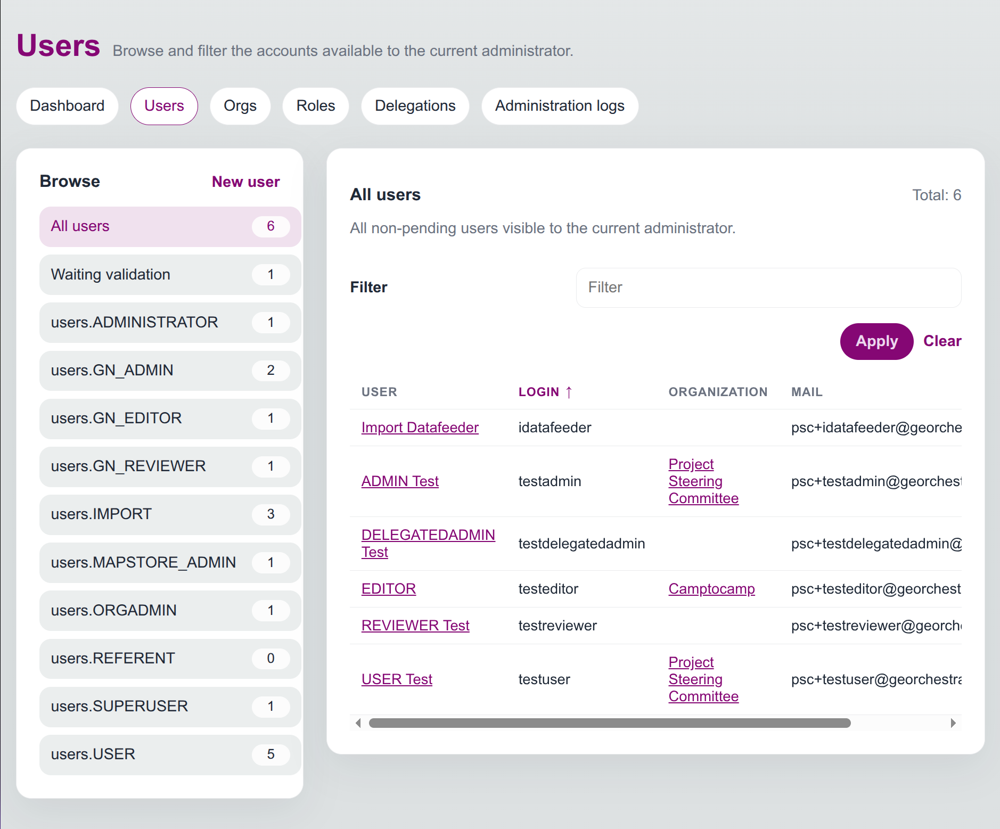
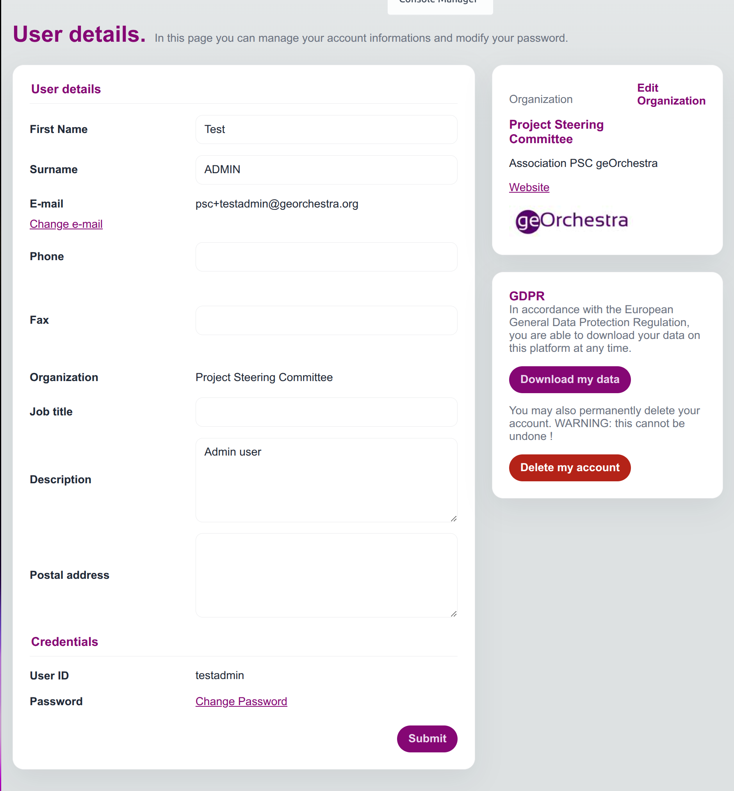

# Administration des utilisateurs

Cette page décrit l'administration fonctionnelle des comptes depuis l'interface manager.

Elle s'adresse aux super-administrateurs et aux administrateurs d'organisation disposant d'une délégation.

## Ce que permet l'interface

Depuis l'onglet `Users`, vous pouvez généralement :

- parcourir les comptes visibles selon vos habilitations ;
- rechercher un utilisateur par nom, identifiant, organisation ou e-mail ;
- ouvrir la fiche détaillée d'un utilisateur ;
- créer un utilisateur ;
- modifier les informations du compte ;
- rattacher l'utilisateur à une organisation ;
- gérer les rôles visibles ;
- valider ou refuser un compte en attente ;
- consulter les messages et les logs liés à l'utilisateur ;
- supprimer un compte si l'action est autorisée.

## Parcours type

### Consulter un utilisateur

1. Ouvrir l'onglet `Users`.
2. Utiliser la recherche ou le tri.
3. Cliquer sur le nom de l'utilisateur.
4. Vérifier l'organisation, les rôles, l'e-mail et l'état du compte.

### Créer un utilisateur

1. Ouvrir `Users`.
2. Cliquer sur `New user`.
3. Renseigner les champs obligatoires : nom, prénom, e-mail, identifiant et organisation.
4. Choisir l'organisation de rattachement.
5. Enregistrer.

À la création, le rôle `USER` est ajouté automatiquement. Les rôles liés à l'organisation peuvent également être appliqués selon la configuration LDAP.

### Modifier un utilisateur

Selon les droits, vous pouvez :

- corriger le nom, le prénom ou l'e-mail ;
- changer le rattachement à une organisation ;
- définir une date d'expiration ;
- ajouter une note interne ;
- modifier l'identifiant si le compte n'est pas externe ;
- confirmer un compte en attente ;
- agir sur les rôles visibles.

Quand le rattachement à une organisation change, les rôles liés à l'ancienne organisation sont retirés et ceux de la nouvelle organisation peuvent être ajoutés.

### Gérer les rôles d'un utilisateur

L'onglet `Roles` de la fiche utilisateur sépare généralement :

- les rôles système ou d'administration ;
- les rôles applicatifs.

Cochez les rôles à affecter, décochez ceux à retirer, puis enregistrez.

Un administrateur délégué ne peut modifier que les rôles compris dans sa délégation.

### Traiter les comptes en attente

Les comptes en attente apparaissent dans la vue `pending`.

Avant validation, vérifiez :

- l'identité de l'utilisateur ;
- l'organisation demandée ;
- l'e-mail ;
- les éventuelles informations de contact ;
- l'existence d'une organisation en attente associée.

Un utilisateur ne peut pas être confirmé si son organisation est encore en attente de validation.

### Supprimer un utilisateur

L'onglet `Manage` permet de supprimer un utilisateur si l'action est autorisée.

La suppression retire le compte du LDAP, retire ses rôles et supprime sa délégation éventuelle.

## Points d'attention

- Un administrateur d'organisation ne voit pas forcément tous les utilisateurs.
- Certains comptes protégés ne sont pas modifiables.
- Les comptes externes ou OAuth2 ne permettent pas toujours de modifier l'identifiant ou le mot de passe.
- Certaines actions dépendent des délégations d'administration et pas uniquement du rôle global.
- Les actions importantes sont consignées dans les logs d'administration afin de tracer les changements effectués.
- L'envoi de mails dépend de la configuration technique ; lorsqu'il est activé, les messages envoyés à un utilisateur sont consultables depuis sa fiche.
